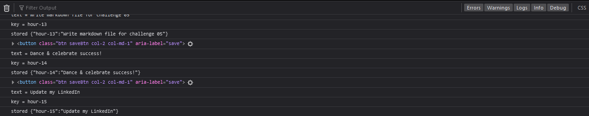

# dayInURLife
Schedule your work day, from the browser!

---
## Table of Contents
[Description](###Description)

[Deployment Link](###Deployment-Link)

[Installation Instructions](###Installation-Instructions)

[Usage](###Usage)

[Contribution Guidelines](###Contribution-Guidelines)

[License](###License)

[Sources](###Sources)

[Questions?](###Questions?)

### Description
>
> This application is a frontend only application that allows a user to build out their own workday planner! Entries persist
> after a refresh of the browser by leveraging `localStorage`, which allows a user to view their last plan and implement that
> same plan on future workdays.
>
> The primary technology used is [jQuery](https://jquery.com/), which is an HTML document traversal & event handling JavaScript
> library. jQuery is an excellent addition to this project because it allowed for very simple creation of HTML elements & adding
> children to those elements with ease.
>
> One of the motivating reasons for creating this project was to give me a chance to play with jQuery more. While vanilla `JS`
> and standard [Document Object Model](https://www.w3schools.com/js/js_htmldom.asp) navigation are robust, jQuery exepdites
> development time because of `jQuery` member function overloading. I was super happy to see how much easier it was to render
> elements dynamically due to the plethora of features that jQuery ships with!
>
> For future development, I have a huge list of ideas to bring this product past the minimum viable product:
#### Future Development
- Allow the user to increment/decrement the workday range
- Auto-refresh which time bands are past, present, or future (rather than on page load like I have)
- `Clear` and `Save all` buttons
- `Export` feature to store all data as a JSON
- Full calendar integration, allowing a user to navigate to different dates to update their planner for each date & export
as events to Google Calendar
---
### Deployment Link
>
> [Deployed Application](https://stevendreed.github.io/dayInURLife/)
---
### Installation Instructions
>
> Navigate to https://stevendreed.github.io/dayInURLife/ and run the application from the browser
---
### Usage
>
> Navigate to [Deployed Application](###Deployment-Link), then click one of the time slots presented. Type into the section,
> and click the save button on the right to save that entry. Now, when the page is refreshed, your todo item is retained!
>
> Shown: application home page 
>
> Shown: adding new todo in a future (green) block 
>
> Shown: verbose `console.log` which tracks modifications to the page 
---
### Contribution Guidelines
>
> Email [Steven Reed](###Questions?) if you're interested in contributing!
---
### License
>
> 
---
### Sources
>
> Special thanks to UCB Extension for building the HTML framework, CSS stylesheets, and for initial hints!
---
### Questions?
>
> [github@stevendreed](https://github.com/stevendreed)
>
> [gmail@Steven Reed](mailto:steven.daniel.reed@gmail.com)
---
dayInURLife by Steven Reed `@github.com/stevendreed`
